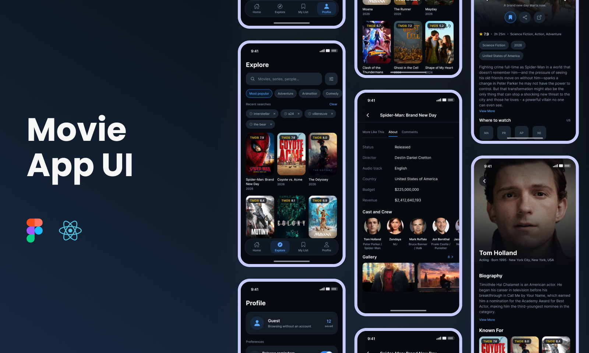

# Movie App (React Native)



This is an **Expo / React Native movie and TV browser** for iOS and Android,
covering discovery, search and filtering, title detail with trailers and
where-to-watch, a saved list, and release-day reminders. All content comes from
the [TMDB API v3](https://www.themoviedb.org/documentation/api).

---

## Features

- Featured hero carousel, plus rails for recommendations, On TV, top rated, in theaters and coming soon
- Debounced multi-search across movies, series and people, with recent searches
- Filter sheet: sort, genre, minimum rating and release year
- Title detail with a parallax hero, trailers, cast, gallery, reviews and franchise collection
- Per-season episode browser for series
- Where to watch, resolved for the device's own region from TMDB's JustWatch data
- In-app YouTube trailer player
- My List, saved on device, with release-day reminders for titles not yet out
- Data saver, trailer autoplay and image-cache controls
- Responses cached per endpoint, and still served when the network fails
- One dark, cinema-style palette, built so poster artwork carries the colour

---

## Tech Stack

| Component             | Description                                  |
| --------------------- | -------------------------------------------- |
| React Native 0.86     | App framework, New Architecture              |
| Expo SDK 57           | Native modules and build tooling             |
| expo-router           | File-based routing on native stacks          |
| TypeScript            | Typed throughout                             |
| TMDB API v3           | Catalogue, artwork, providers and reviews    |
| Reanimated 4          | Parallax heroes, cross-fading headers        |
| expo-image            | Artwork with memory and disk caching         |
| AsyncStorage          | Saved list, preferences and response cache   |
| react-native-webview  | In-app YouTube trailer player                |
| expo-notifications    | Scheduled release-day reminders              |
| expo-blur             | Floating glass tab bar and headers           |
| Jest / jest-expo      | Unit tests for the API and cache layers      |

---

## Setup Instructions

1. **Clone Repository**

   ```bash
   git clone https://github.com/deinf/movie_app.git
   cd movie_app
   ```
2. **Install Dependencies**

   ```bash
   npm install
   ```
3. **Add a TMDB Key**

   ```bash
   cp .env.example .env
   ```

   Paste a free v3 key from
   [themoviedb.org/settings/api](https://www.themoviedb.org/settings/api). It
   must be named `EXPO_PUBLIC_TMDB_API_KEY` — Expo only inlines env vars with
   that prefix into the client bundle. Restart the dev server after changing it.
4. **Requirements**

   Node 20+, and Xcode (iOS) or Android Studio (Android).
5. **Run on a Device or Simulator**

   ```bash
   npm run ios
   npm run android
   ```

   These call `expo run:*`, which generates the native projects and compiles
   them. `ios/` and `android/` are generated output and stay gitignored, so
   change `app.json` and let prebuild regenerate them. The app icon and splash
   screen only appear in these builds; Expo Go substitutes its own.
6. **Bundler Only**

   ```bash
   npm start
   ```

   Serves JS to **Expo Go**, no native compile. The `--go` flag is pinned in the
   script, so this stays on Expo Go once `ios/` and `android/` exist rather than
   defaulting to dev-client mode.
7. **Checks**

   ```bash
   npm test            # jest, API client and cache helpers
   npx tsc --noEmit    # types
   npm run lint        # eslint, expo config and React Compiler rules
   ```

---

## Features Checklist

### Browse

- [X] Featured hero carousel from TMDB trending
- [X] Five rails: recommendations, On TV, top rated, in theaters, coming soon
- [X] "See all" paginated grids with infinite scroll
- [X] Pull to refresh
- [X] Skeletons shaped like the real content, so nothing jumps when data lands
- [X] A failed rail steps aside instead of blanking the page

### Search and Filter

- [X] Debounced multi-search across movies, series and people
- [X] Recent searches, individually removable
- [X] Filter sheet: sort, genre, minimum rating, release year
- [X] Active filters summarised as chips, tap to clear
- [X] Infinite-scrolling results grid

### Title Detail

- [X] Parallax hero with trailer playback
- [X] Where to watch, region-aware, attributed to JustWatch
- [X] Trailers, featurettes and clips
- [X] Cast and crew, linked to person pages
- [X] Gallery with a full-screen, zoomable, paging viewer
- [X] Reviews, with a link to the rest on TMDB
- [X] Franchise collection row
- [X] Per-season episode list for series
- [X] Share the title's TMDB page

### Library

- [X] Save any title to My List, persisted on device
- [X] Clear all, with confirmation
- [X] Release reminders for saved titles not yet out
- [ ] Accounts and cross-device sync

### Preferences

- [X] Autoplay trailers
- [X] Data saver, dropping artwork to smaller TMDB buckets
- [X] Clear cached artwork and listings
- [X] Notification permission requested on toggle, not at launch
- [ ] Light theme — the dark palette is pinned by design

---

This product uses the TMDB API but is not endorsed or certified by TMDB.

---

## Contact

**Danang Eka Saputra**
GitHub: [@deinf](https://github.com/deinf)
Email: danangekasaputra@outlook.com
